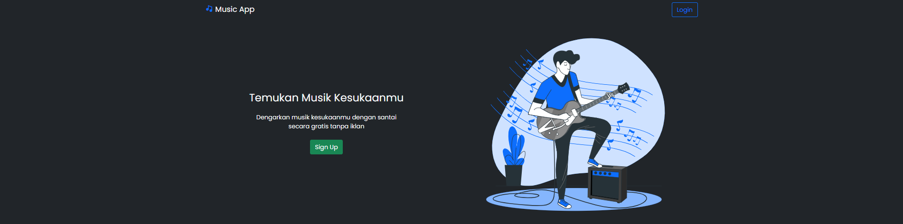
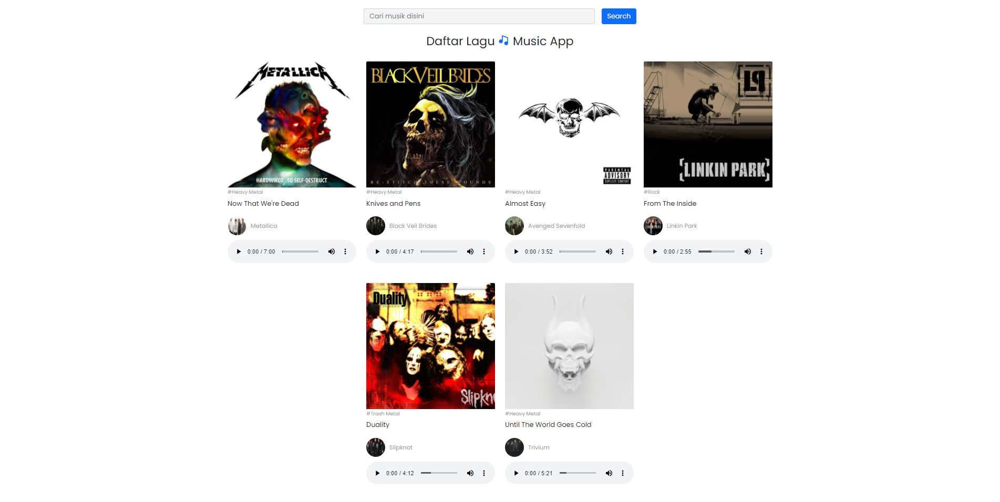

# Music App

Music App adalah sebuah aplikasi sederhana dengan sistem CRUD (Create Read Update Delete). Music App dibangun menggunakan Node.js dengan framework Express.js, Bootstrap 5, Boxicons dan Sweetalert2.

## Langkah-langkah menginstall Music App

1. Pastikan teman-teman sudah menginstall XAMPP, jika sudah silakan jalankan Apache dan MySQL pada XAMPP
2. Masuk ke local host phpmyadmin pada browser (http://localhost/phpmyadmin), atau dapat mengklik tombol admin pada MySQL di XAMPP
3. Buat database baru dengan nama db_music
4. Import file db_music.sql ke dalam database db_music yang sebelumnya sudah dibuat. Terdapat beberapa record yang sudah terisi, itu dapat diabaikan saja
5. Install node.js (jika belum)
6. Masuk ke folder Music App pada code editor yang teman-teman gunakan
7. Buka terminal pada code editor
8. Jalankan perintah npm i dan tunggu hingga prosesnya selesai
9. Jalankan perintah npm start
10. Tunggu hingga muncul notifikasi Server listening on port 1000 pada terminal
11. Buka browser dan ketik http://localhost:1000/
12. Aplikasi Music App siap digunakan (login sebagai admin -> email : admin@gmail.com, password : admin)

Tampilan aplikasi Music App

